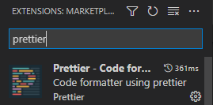

# 질권 설정 프로젝트 정리

##  빌드하기 : nexus repository
### 전체 구조


#### 1.nexus docker 설치
- 기본 nexus docker 올리기
https://hub.docker.com/r/sonatype/nexus3/
- [nexus proxy repository 등록, public repostiory 등록](https://help.sonatype.com/repomanager3/formats)
    - 설명
      - 톱니바퀴 > Repository > Blob Stores > Create blob store
    - docker
    ```
    Name: docker-proxy
    Format: docker
    Type: proxy
    Online: true
    Docker registry API Support
    - allow clients to use the V1 API to interact with this repository

    Proxy
    - Remote Storage : https://registry-1.docker.io

    Storage
    - blob store : docker_images
    Docker Index
    - Use Docker Hub
    ```

    - gradle plugin
    ```
    Name: gradle-plugin
    Format: maven2
    Type: proxy
    Online : true
    
    Proxy
    - Remote Storage : https://plugins.gradle.org/m2/
    Storage
    - blob store : default
    ```
    - maven central
    ```
    Name: maven-central
    Format: maven2
    Type: proxy
    Online : true
    
    Proxy
    - Remote Storage : https://repo1.maven.org/maven2
    Storage
    - blob store : default
    ```
    - npm proxy
    ```
    Name: npm-proxy
    Format: npm
    Type: proxy
    Online : true
    
    Proxy
    - Remote Storage : https://registry.npmjs.org/
    Storage
    - blob store : npm
    ```

    - maven public
    ```
    Name: maven-public
    Format: maven2
    Type: group
    Online : true

    Maven2
    - version policy: mixed
    
    Proxy
    - Remote Storage : https://repo1.maven.org/maven2
    Storage
    - blob store : default
    
    Group
    - Members
      - maven-central
      - gradle-plugin
    ```


#### 2. npm 설정
https://help.sonatype.com/repomanager3/formats/npm-registry
1. auth 생성하기

    bash   
    ```bash
    > echo -n 'admin:admin123' | openssl base64
    > YWRtaW46YWRtaW4xMjM=
    ```
2. root 폴더에 설정

    .npmrc
    ```
    registry=<nexus url>/repository/<repository name>
    _auth=YWRtaW46YWRtaW4xMjM=
    ```
    package.json에 추가
    ```
    "publishConfig" : {
    "registry" : "http://localhost:8081/repository/npm-internal/"
    }, 
    ```

#### 3. gradle
version: 6.8
1. <GRADLE_USER_HOME>/gradle.properties 설정

    ```
    nexusUsername=<nexus user name>
    nexusPassword=<nexus 비밀번호>
    ```
2. root 폴더에 설정
   - settings.gradle
   ```groovy
   pluginManagement {
       repositories {
           maven {
               url = uri('<nexus url>/repository/maven-public')
               credentials {
                   project.nexusUsername
                   project.nexusPassword
               }
           }
       }
   }
   rootProject.name = '<project name>'
   ```

   - build.gradle
   ```groovy
   buildscript {
       dependencies {
           // plugin dependencies 추가 : https://plugins.gradle.org/ 에서 검색
           
       }
   }
   plugins {
       // plugin 추가
   }
   apply plugin: '<plugin>'

   repositories {
       maven {
           url = uri('<nexus url>/repository/maven-public')
           credentials {
                project.nexusUsername
                project.nexusPassword
            }
       }
   }
   depedencies {
       // depedencies 추가
   }
   ```
#### 4. docker

```
진행 중
```

## frontend - nuxt
### 시작

```
npm init nuxt-app <project name>
```
## 폴더구조
```
- assets
- components
- layouts
- pages
- static
- target
```
### vscode- vetur 설정
- vscode extension




- .vscode/settings.json 추가

```json
{ ..
    "[jsonc]": {
        "editor.defaultFormatter": "esbenp.prettier-vscode"
    },
    "javascript.updateImportsOnFileMove.enabled": "always",
    "[javascript]": {
        "editor.defaultFormatter": "esbenp.prettier-vscode"
    },
    "[vue]": {
        "editor.defaultFormatter": "octref.vetur"
    },
    "json.maxItemsComputed": 25000,
    "prettier.trailingComma": "none",
}
```
- ./jsconfig.json

```json
{
    "compilerOptions":{
        "baseUrl": ".",
        "paths":{
            "@/*": ["./*"]

        }
    },
    "exclude" : ["node_modules", "dist"]
}
```
### 빌드 설정
1. ./nuxt.config.js
```js
const CUSTOM_BASE_URL =
  process.env.NODE_ENV === "production"
    ? process.env.BASE_URL
    : "http://localhost:8081";
const CUSTOM_API_BASE_URL =
  process.env.NODE_ENV === "production"
    ? process.env.API_BASE_URL
    : "http://localhost:8085/api";
console.log(CUSTOM_BASE_URL);
console.log(CUSTOM_API_BASE_URL);
export default {
  ssr: true,
  static: {
    prefix: false,
  },
  // Global page headers: https://go.nuxtjs.dev/config-head
  head: {
    title: ":: NowRMS 표준 솔루션 ::",
    htmlAttrs: {
      lang: "en",
    },
    meta: [
      { charset: "utf-8" },
      { name: "viewport", content: "width=device-width, initial-scale=1" },
      { hid: "description", name: "description", content: "" },
      { name: "format-detection", content: "telephone=no" },
    ],
    link: [
      { rel: "icon", type: "image/x-icon", href: "/favicon.ico" },
      
    ],
    script: [
    ],
  },

  // Global CSS: https://go.nuxtjs.dev/config-css
  css: [
    "~/assets/css/common",
    "~/assets/css/style02",
    "~/assets/css/kb",
    "~/assets/css/font_.css",
  ],
  parseOptions: {
    parser: "babel-eslint",
  },
  // Plugins to run before rendering page: https://go.nuxtjs.dev/config-plugins
  plugins: [
    { src: "~/plugins/array.js" },
    { src: "~/plugins/math.js" },
    { src: "~/plugins/shadydom-wo-click.js" },
    { src: "~/plugins/axios.js" },
    { src: "~/plugins/notifier.js" },
  ],

  // Auto import components: https://go.nuxtjs.dev/config-components
  components: true,

  // Modules for dev and build (recommended): https://go.nuxtjs.dev/config-modules
  buildModules: [["@nuxtjs/vuetify", { treeShake: true }], "@nuxtjs/dotenv"],
  publicRuntimeConfig: {
    BASE_URL: CUSTOM_BASE_URL,
    API_BASE_URL: CUSTOM_API_BASE_URL,
    axios: {
      proxy: true,
      baseURL: CUSTOM_BASE_URL,
    },
  },
  proxy: {
    "/api": {
      target: CUSTOM_API_BASE_URL,
      pathRewrite: { "/api/": "/" },
      changeOrigin: true,
    },
  },
  // Modules: https://go.nuxtjs.dev/config-modules
  modules: [
    "@nuxtjs/axios",
    "@nuxtjs/proxy",
    
  ],

  // Build Configuration: https://go.nuxtjs.dev/config-build
  build: {
    
  },
  // transpile: ['vuetify'],
  vuetify:{
    treeshake: true,
    defaultAssets: false,
    customVariables: ["~/assets/variables.scss"],
    options: { 
        customProperties: true
    },
    theme:{
        ...
    }
  }
};

```
- 환경 설정
- axios - proxy 설정
    - nuxt.config.js
    ```js
    const CUSTOM_BASE_URL =
    process.env.NODE_ENV === "production"
        ? process.env.BASE_URL
        : "http://localhost:8081";
    const CUSTOM_API_BASE_URL =
    process.env.NODE_ENV === "production"
        ? process.env.API_BASE_URL
        : "http://localhost:8085/api";
    export default {
        ...
        publicRuntimeConfig: {
            BASE_URL: CUSTOM_BASE_URL,
            API_BASE_URL: CUSTOM_API_BASE_URL,
            axios: {
            proxy: true,
            baseURL: CUSTOM_BASE_URL,
            },
        },
        proxy: {
            "/api": {
            target: CUSTOM_API_BASE_URL,
            pathRewrite: { "/api/": "/" },
            changeOrigin: true,
            },
        },
        // Modules: https://go.nuxtjs.dev/config-modules
        modules: [
            "@nuxtjs/axios",
            "@nuxtjs/proxy",
            
        ],
    }

    ```


- nuxt 속도 개선
  - nuxt.config.js
    ```js
    export default {
        ...
        // ssr을 사용하면 프론트엔드의 사양때문에 느려지는 것을 완화 한다.
        ssr: true, 
        // 빌드 속도 개선 - components: true일 경우 component import를 자동으로 해주나 빌드가 매우 느려질 수 있다.
        components: false 
        ...
    }
    ```


- middleware 설정  
```js
export default function ({ store, redirect, route }) {
    //If the user is not authenticated
    // store에서 athenticated 여부 확인
    // 로그인 안됐을 시에
    
    if (!store.state.authenticated) {
      return redirect('/login')
    }
    // 로그인 됐을 시
    if(route.path == '/'){
        return redirect("/rgst/appl/list")
    }
    
}
```
  - localhost:8081/로 접속하면 로그인 됐을 시는 /rgst/appl/list로 redirect 됨
    

- layout 설정
- ie11 문제 해결
  - babel 설정 ( nuxt.config.js)
  ```js
  export default{
    ...
    parseOptions: {
        parser: "babel-eslint",
    },
     plugins: [
        { src: "~/plugins/array.js" },
        { src: "~/plugins/math.js" },
        { src: "~/plugins/shadydom-wo-click.js", mode: "client" },
        { src: "~/plugins/axios.js" },
        ...
    ],
  
  }
  ```
  - /plugins/array.js
  ```js
  if ( ![].fill)  {
    Array.prototype.fill = function( value ) {
  
      var O = Object( this );
      var len = parseInt( O.length, 10 );
      var start = arguments[1];
      var relativeStart = parseInt( start, 10 ) || 0;
      var k = relativeStart < 0
              ? Math.max( len + relativeStart, 0) 
              : Math.min( relativeStart, len );
      var end = arguments[2];
      var relativeEnd = end === undefined
                        ? len 
                        : ( parseInt( end)  || 0) ;
      var final = relativeEnd < 0
                  ? Math.max( len + relativeEnd, 0 )
                  : Math.min( relativeEnd, len );
  
      for (; k < final; k++) {
          O[k] = value;
      }
  
      return O;
    };
  }
  ```
  - /plugins/math.js
  ```js
  Math.cbrt = Math.cbrt || function(x) {
    var y = Math.pow(Math.abs(x), 1/3);
    return x < 0 ? -y : y;
  };
  ```
  - [./plugins/shadydom-wo-click.js](files/shadydom-wo-click.js)
  - vuetify 설정 
    - shadowydom, math.cbrt, array.fill

  
- vuetify 설정
  - default style 변경


### components
- pagination
    - components/common/NowrmsPagination.vue


```vue
<template>
    <!-- 페이지 네비게이션 -->
    <div id="navi">
        <input
        v-if="length!=0 && value >1"
        @click="setPageNum(1)"
        type="button" class="btn_01" name="navi_first" value="<<" >

        <p>
            <template v-for="i in pageRange">
                
                <span v-if="value ===i" 
                @click="setPageNum(i)" 
                class="page_crt">{{i}}</span>
                <span v-else @click="setPageNum(i)" >{{i}}</span>
                
            </template>
        </p>
        <input 
        v-if="length!=0 && value <length"
        @click="setPageNum(length)"
        type="button" class="btn_01" name="navi_last" value=">>">
    </div>
</template>
<script>
    export default {
        props:{
            value: Number, // current page
            length: Number, // total page
            totalVisible:Number, // 보이는 page
        },
        computed: {
            pageRange(){
                const pageRange = [];
                if(this.value && this.length && this.totalVisible){
                    let startPage = Math.floor(this.length/ this.totalVisible) + 1;
                    for(let i=startPage; i<= this.value + this.totalVisible; i++){

                        if(i<= this.length) pageRange.push(i);
                        else break;
                        
                    }
                    return pageRange;
                }else{
                    return [1];
                }
            }
        },
        methods:{
            setPageNum(number){
                this.$emit('input', number);
            }
        }
    }
</script>
```
  
```vue
<template>
        <!-- 페이지 네비게이션 -->
    <NowrmsPagination
      v-model="pageNum"
      :length="totalPage"
      :total-visible="resultCnt"
    />
  </div>
</template>
<script>
import NowrmsPagination from "@/components/common/NowrmsPagination.vue";
export default {
  middleware: "authenticated",
  components: { NowrmsPagination},
  
  computed: {
    pageNum: {
      get() {
        return this.$store.state.rgst.applComplist.page_num;
      },
      set(value) {
        this.$store.commit("rgst/applComplist/setPageNum", value);
      },
    },
    totalPage() {
      return this.$store.state.rgst.applComplist.totalPage;
    },
    resultCnt() {
      return this.$store.state.rgst.applComplist.resultCnt;
    },
  },
};
```
1. docker 설정